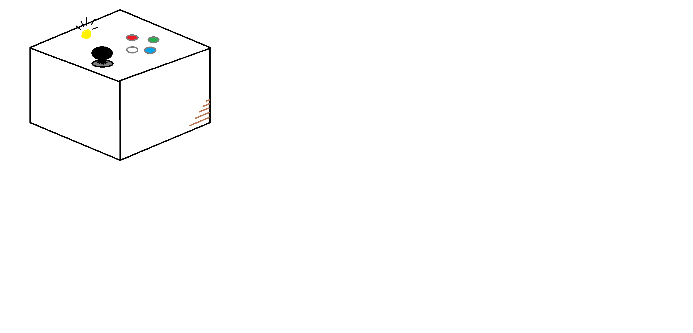

# Controle Customizado para Castle Crashers

## jogo
**Castle Crashers** -  Um jogo de ação e aventura em estilo beat 'em up, com visual cartoonizado, onde cavaleiros enfrentam hordas de inimigos, chefes e completam missões resgatando princesas e salvando o reino.
## Ideia do Controle
O controle será um clássico controle de arcade: um joystick para movimentação do personagem e quatro botões de ação. Os botões serão usados para diferentes formas de atacar, usar magia e defender. LED indicara o estado de carregamento do computador.

## Inputs e OutPuts
### Entradas(inputs)
- **Joystick analogico**: Para movimentacao do personagem
### Entradas Digitais
- **botao de ataque**: ataque principal do personagem
- **botao de arco**: ataque de longo alcance
- **botao de macro **: botao para habilidades especiais
- **botao de esquivar**: realizar desvio rapido

### **Saidas(outputs)**
-**LED indicando que o PC esta recarregando**

### Protocolo Utilizado
-**UART** comunicao controle e computador
-**GPIO Interrupts** botoes e entradas digitais(interrupcoes)

## Diagrama de Blocos Firmware
### *Estrutura Geral*
---
+---------------------+ 
| Task Captura | 
| Joystick, Botões |
+---------------------+
        ↓
+---------------------+
|  Filas de Eventos  |
+---------------------+
        ↓
+---------------------+
| Task Processamento |
|    de Eventos      |
+---------------------+
        ↓
+---------------------+
| Task Comunicação   |
|       com PC       |
+---------------------+
        ↓
+---------------------+
|  Task Feedback     |
|         (LED)       |
+---------------------+

---

### **Principais Componester do RTOS**
-**Tasks**
Tasks:

        Task de Leitura de Entradas: Lê valores do joystick e dos botões.

        Task de Processamento de Eventos: Interpreta comandos e envia para a fila de comunicação.

        Task de Comunicação com o Jogo: Envia os comandos processados via UART para o computador.

        Task de Feedback Visual: Atualiza o estado do LED.

Filas:

    Fila de eventos de entrada: armazena eventos vindos do joystick e botoes para processamento.

    Fila de comandos para o jogo: contem os comandos que serao enviados para o computador.

Semáforos:

    Semáforo de estado de conexão: Garante que o LED e outros componentes respondam corretamente ao estado da conexao com o jogo.

Interrupts:

    Callbacks para botões: os botoes (ataques, magia, defesa) geram interrupoces para reduzir latência na resposta.

## Imagens do Controle
### ideia inicial(econtrole arcade com botoes e joystick)
--

--

